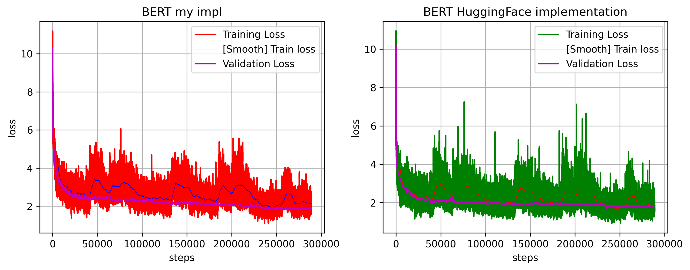
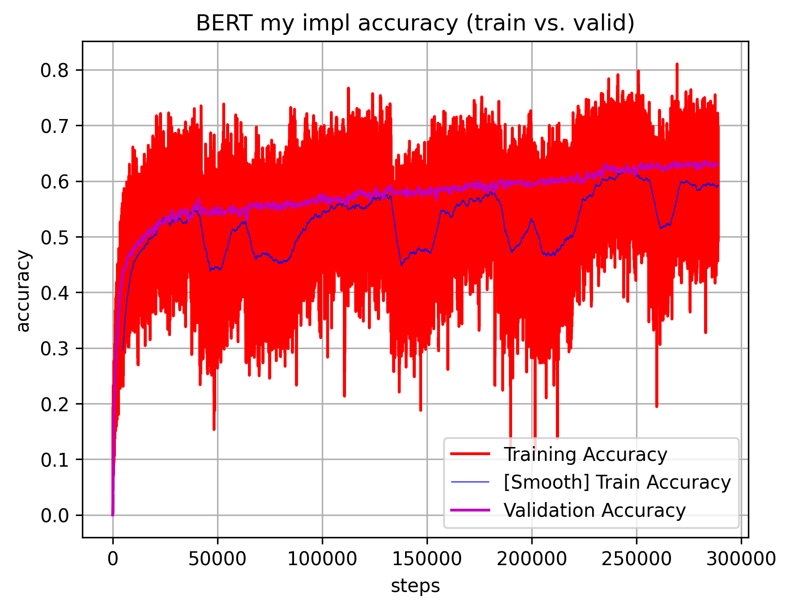

# BERT written from scratch in pytorch

Sharing my code for BERT from scratch. This was significantly more time consuming to write than GPT-2 as I couldn't find any exhaustive tutorials so had to use BERT paper for reference. I also extensively looking into HF code (which is quite convoluted).

As BERT paper doesn’t really share much about pre-training performance, I used HF implementation for reference. I checked how it behaves during training and validation in terms of loss and accuracy and compared to my own. I also checked the final performance of HF pre-trained model with my own.

In comparison to BERT paper I pre-trained just for 1 epoch, only with BookCorpus dataset and without Next Sentence Prediction (as later publications showed that it actually makes things worse).

My result is training accuracy = 0.614243 with loss = 1.921875 (or validation accuracy = 0.6306, with loss 1.8438) at the end of training. In comparison to accuracy: 0.5167 / loss: 2.78125 for HuggingFace pre-trained model tested on same validation set. Not bad!

Training took about 2 days on 2xH100.

Model:
- bert.py - BERT model code
- transformer.py - basic transformer code 

Training code:
- train.py - main file to run for training the model
- output_log_analysis.ipynb - plotting results

Reference scripts to compare my implementation with HuggingFace implementation:
- bert_hf_notrianer.py - close replication on my own training code in torch but with HF model code (untrained)
- bert_hf_trainer.py - training code using all the HF wrappers that simplify everything but don't replicate my own torch pipeline
- bert_hf_pretrained_test.py - testing performance and I/O of HF pre-trained HF model (same model as both scripts above but already pre-trained)

Initial testing with small dataset (IMDB reviews):
- train_imdb.py
- process_imdb.py
- train_imdb_e4_22_06_2025.out

-----

For reference. In case somebody has similar issues as I did. Some of the biggest bugs I had writing this one:
- using softmax prior to cross entropy (cross-enthropy already has softmax integrated). This made loss go down just a bit and then stay on same level forever. Entire model seemed ok but somehow didn't learn. Was very frustrating, to discover this issue I practically ripped apart the entire codebase and went deep into every single line.
- didn't remove segment embedding from BERT initialisation although it was removed from forward pass (I did this after deciding to go with NSP). Worked ok-ish with single node but crashes on distributed version.
- accuracy calculation bug (was masking wrong token value, ie. Previously used 0 but switched to -100). Relatively easy to correct but made entire experience quite frustrating as for days I didn't see any progress (and then suddenly it was very good when the bug was fixed :)