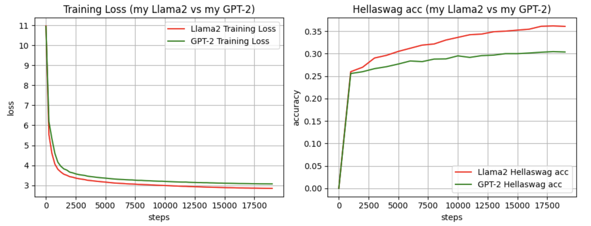

# Llama2 written from scratch in pytorch

Sharing my code for Llama2 from scratch. This is an initial version, converted from my GPT-2 code. There is still quite a bit leftovers from GPT-2: I kept the same training dataset and re-used all the shards I have generated previously (which means same tokenizer and same vocab size, which dont quite match the llama2 paper).

The main changes in comparison to GPT-2 code:
- added [RMS Norm](https://docs.pytorch.org/docs/stable/generated/torch.nn.modules.normalization.RMSNorm.html), instead of regular Layer Normalization
- added [SiLU activation](https://docs.pytorch.org/docs/stable/generated/torch.nn.SiLU.html), instead of GELU
- removed all Dropouts
- added [RoPE](https://arxiv.org/abs/2104.09864) / Rotary Positional Embedding, instead of the regular absolute positional embedding (this is probably the biggest change)

For now, I kept same amount of Transformer blocks as GPT-2. Training took about ~1 day on 2xH100, I decreased the batch size form 64 to 32. Interestingly, given all above changes, the Hellaswag accuracy is actually better than GPT-2 after exactly the same training process/dataset (went from 0.306 to 0.36 - not bad!). Looking at the loss diagram - the difference looks actually quite familiar to what I have seen in RoPE experiments - so maybe this is where the key difference (accuracy-wise) comes from.

Model:
- llama2.py - llama2 model code
- transformer.py - basic transformer code, attention is modified to accomodate for RoPE

Training code:
- train.py - main file to run for training the model
- output_log_analysis.ipynb - plotting results

Datasets:
- fineweb.py - split fineweb_edu dataset into tokenized shards 
- hellaswag_eval.py - hellaswag evaluation code