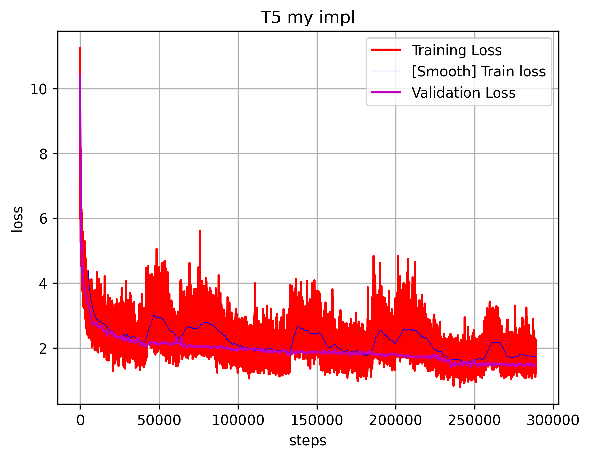
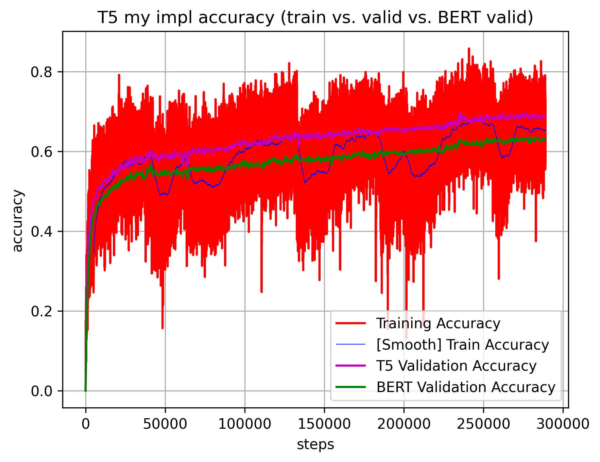

# BERT written from scratch in pytorch

Sharing my code for T5 from scratch. To large extent this is based on my BERT implementation.

I used same dataset, bookcorpus, (which is different to ones mentioned T5 article), also similar network settings/bert tokenizer to get everything up and running faster. The key difference is the architecture: T5 uses encoder-decoder architecture; whereas BERT used only encoder (compared to GPT/Llama that use only decoder).

The interesting side effect of the choice above, it makes an interesting comparison to BERT as eveything is configured and trained in similar manner. Result: T5 gets quite a bit better accuracy: validation accuracy = 0.6883 vs. 0.6306 for BRET at the end of training.

Similar as BERT training took about 2 days on 2xH100.

Model:
- t5.py - T5 model code
- transformer.py - basic transformer code, this has quite some modifications to accomodate for encoder/decoder architectures

Training code:
- train.py - main file to run for training the model
- output_log_analysis.ipynb - plotting results